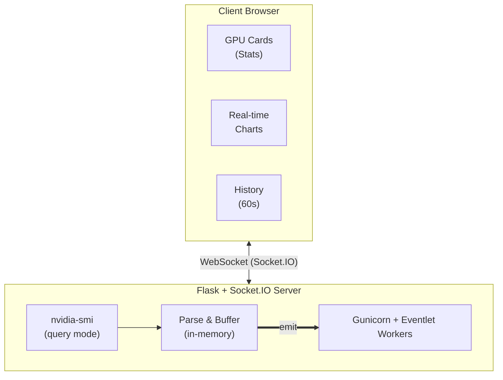

# NVIDIA GPU Monitor

> **AI-Assisted Development** — This project was developed with the assistance of AI tools.

Real-time GPU monitoring dashboard that parses `nvidia-smi` every second and displays interactive graphs via WebSocket. Includes active process monitoring per GPU with the ability to kill processes directly from the dashboard.

> **Disclaimer**: This tool is designed for monitoring and visibility on small-scale servers and workstations. It is **not intended for production environments** that require high availability, persistent data retention, or enterprise-grade alerting. For production-grade GPU observability, consider a dedicated stack such as Grafana + Prometheus/InfluxDB, Datadog, or NVIDIA DCGM.

## Table of Contents

- [Purpose](#purpose)
- [Features](#features)
- [Metrics Collected](#metrics-collected)
- [Screenshots](#screenshots)
- [Quick Start](#quick-start)
  - [Prerequisites](#prerequisites)
  - [Run with Docker Compose](#run-with-docker-compose)
  - [Build & Run Manually](#build--run-manually)
  - [Development (Local)](#development-local)
- [Architecture](#architecture)
- [Configuration](#configuration)
  - [Environment Variables](#environment-variables)
  - [Docker Compose Options](#docker-compose-options)
  - [Key Settings](#key-settings)
- [Troubleshooting](#troubleshooting)
  - [No GPUs Detected](#no-gpus-detected)
  - [WebSocket Connection Issues](#websocket-connection-issues)
  - [Login Page Doesn't Appear](#login-page-doesnt-appear)
  - [Process Killing Doesn't Work](#process-killing-doesnt-work)
  - [`nvidia-smi` Not Found in Container](#nvidia-smi-not-found-in-container)
  - [Health Check](#health-check)
- [HTTP Routes](#http-routes)
- [Socket.IO Events](#socketio-events)
- [Tech Stack](#tech-stack)
- [License](#license)

## Purpose

A lightweight GPU monitoring tool designed for small-scale servers and workstations that need visibility into GPU utilization, temperatures, power draw, and active processes — **without the overhead of a full Grafana + InfluxDB/Prometheus stack**.

If you have a single server with one or more GPUs and just want a quick dashboard to keep an eye on things (or to let a small team monitor GPU resources), this gives you real-time charts and process management in a single Docker container with zero external dependencies.

For large-scale deployments with retention, alerting, and multi-host aggregation, a proper observability stack like Grafana/Prometheus is still recommended.

## Features

- **Real-time monitoring**: Parses `nvidia-smi` every second using structured query mode
- **In-memory buffering**: Configurable buffer size (up to 600 data points by default, ~10 minutes)
- **Interactive graphs**: Real-time Chart.js graphs for all metrics (60-second rolling window)
- **Process monitoring**: Lists active GPU compute processes with PID, VRAM usage, and process name
- **Process management**: Kill GPU processes directly from the dashboard (requires `pid: host`)
- **Authentication**: Optional password-based login (enabled via `MONITOR_PASSWORD` env var)
- **Multi-GPU support**: Automatically detects and monitors all available GPUs
- **WebSocket streaming**: Live data updates via Socket.IO without page refresh
- **Responsive UI**: Dark-themed dashboard optimized for desktop and mobile
- **Dockerized**: Production-ready with Gunicorn + Eventlet

> **Note**: All data is stored in-memory only. GPU history is lost when the container restarts. For persistent storage, consider integrating with an external database.

## Metrics Collected

The following 13 metrics are collected per GPU every second:

| Metric | Description |
|--------|-------------|
| `gpu_util` | GPU utilization (%) |
| `mem_util` | Memory utilization (%) |
| `mem_used` | VRAM used (MB) |
| `mem_total` | Total VRAM (MB) |
| `temperature` | GPU temperature (°C) |
| `power_draw` | Current power draw (W) |
| `power_limit` | Power limit (W) |
| `fan_speed` | Fan speed (%) |
| `gpu_clock` | Current graphics clock (MHz) |
| `mem_clock` | Current memory clock (MHz) |
| `video_clock` | Current video clock (MHz) |
| `name` | GPU model name |
| `index` | GPU index (0, 1, 2, …) |

## Screenshots


## Quick Start

### Prerequisites

- Docker & Docker Compose installed
- NVIDIA Container Toolkit configured
- NVIDIA GPU with drivers installed

### Run with Docker Compose

```bash
docker compose up --build
```

The dashboard will be available at: **http://localhost:5000**

### Build & Run Manually

```bash
# Build the image
docker build -t nvidiagraph .

# Run the container
docker run -p 5000:5000 --gpus all nvidiagraph
```

### Development (Local)

```bash
# Install dependencies
pip install -r requirements.txt

# Run the Flask development server
python app.py
```

## Architecture



## Configuration

### Environment Variables

| Variable | Default | Description |
|----------|---------|-------------|
| `HOST` | `0.0.0.0` | Host interface the server binds to. |
| `PORT` | `5000` | Port the server listens on. |
| `MONITOR_PASSWORD` | `""` (empty) | Password for dashboard login. Leave empty to disable authentication. Whitespace is automatically trimmed; compared with timing-safe check (`hmac.compare_digest`). |
| `MAX_HISTORY` | `600` | Max data points buffered per GPU (~10 min at 1 sample/s). |
| `SECRET_KEY` | `nvidia-gpu-monitor-secret-key` | Flask secret key for session management. |

> **Note**: When `MONITOR_PASSWORD` is set to a non-empty value, a login page will be shown before accessing the dashboard. The WebSocket connection will also require authentication.

> **Production**: Set a unique `SECRET_KEY` in production. The default value is insecure and should not be used in environments where session hijacking is a concern.

### Docker Compose Options

Edit `docker-compose.yml` to customize:

```yaml
services:
  nvidiagraph:
    ports:
      - "8080:5000"  # Change host port mapping
    pid: host        # Required for process killing to work (maps host PIDs into container)
    environment:
      - NVIDIA_VISIBLE_DEVICES=all        # Limit to specific GPUs if needed
      - MONITOR_PASSWORD=your_password    # Enable login authentication
      - MAX_HISTORY=300                   # Reduce buffer to ~5 minutes
      - SECRET_KEY=your-secure-key        # Set a unique secret key in production
    deploy:
      resources:
        reservations:
          devices:
            - driver: nvidia
              count: 1  # Use specific GPU count (default: all)
              capabilities: [gpu]
    # Mount nvidia-smi from host if needed (see note below)
    # volumes:
    #   - /usr/bin/nvidia-smi:/usr/bin/nvidia-smi:ro
    #   - /usr/lib/x86_64-linux-gnu/libnvidia-ml.so.1:/usr/lib/x86_64-linux-gnu/libnvidia-ml.so.1:ro
```

> **`pid: host`**: The container runs with the host PID namespace so that process PIDs inside the container match the host — this is required for the "kill process" feature to work correctly.

> **Volume mounts**: Uncomment the volume mounts if your host's `nvidia-smi` version differs from the CUDA base image, or if you encounter `nvidia-smi: command not found` errors despite having NVIDIA drivers installed on the host.

### Key Settings

| Setting | Default | Description |
|---------|---------|-------------|
| `MAX_HISTORY` | `600` | Max data points buffered per GPU (~10 min at 1 sample/s) |
| Sample interval | `1 second` | How often `nvidia-smi` is queried |
| Chart window | `600 entries` | Data points sent to client for real-time graphs |

## Troubleshooting

### No GPUs detected

1. Verify NVIDIA drivers are installed on the host:
   ```bash
   nvidia-smi
   ```

2. Verify NVIDIA Container Toolkit is installed:
   ```bash
   docker run --rm --gpus all nvidia/cuda:12.5.1-base-ubuntu22.04 nvidia-smi
   ```

3. Check container logs:
   ```bash
   docker compose logs
   ```

### WebSocket connection issues

- Ensure port 5000 is accessible from the browser
- Check firewall settings
- CORS is set to `*` (all origins allowed) in the app config

### Login page doesn't appear

- Make sure `MONITOR_PASSWORD` is set to a non-empty value in `docker-compose.yml`
- Restart the container after changing environment variables: `docker compose up --build`
- Clear your browser cookies/session if switching between authenticated and non-authenticated modes

### Process killing doesn't work

- The container uses `pid: host` to access host PIDs — ensure this is set in `docker-compose.yml`
- Process killing uses `kill -9` which requires appropriate permissions
- Only PIDs currently active in the GPU process list can be killed (PID verification is performed)

### `nvidia-smi` not found in container

The Dockerfile uses the `nvidia/cuda:12.5.1-runtime-ubuntu22.04` base image which includes `nvidia-smi`. If still not found, uncomment the volume mounts in `docker-compose.yml` to bind-mount `nvidia-smi` from the host. This is useful when your host's `nvidia-smi` version differs from the CUDA base image.

### Health Check

The container includes a Docker health check that curls `http://localhost:5000/` every 30 seconds. You can check container health with:

```bash
docker inspect --format='{{.State.Health.Status}}' nvidiagraph
```

## HTTP Routes

| Route | Method | Description |
|-------|--------|-------------|
| `/` | GET | Main dashboard (requires auth if `MONITOR_PASSWORD` is set) |
| `/login` | GET, POST | Login page (redirects to dashboard if no password is configured) |
| `/logout` | GET | Clear session and redirect to login page |

## Socket.IO Events

### Server → Client

| Event | Description |
|-------|-------------|
| `connected` | Sent on initial connection with a welcome message |
| `require_login` | Sent if WebSocket connects without authentication (when `MONITOR_PASSWORD` is set) |
| `gpu_info` | GPU count and history length per GPU |
| `gpu_data` | Latest GPU metrics + active processes (every ~1s) |
| `gpu_history` | Full in-memory history for real-time chart updates |
| `gpu_full_history` | Complete history sent on `request_full_history` |
| `kill_result` | Result of a `kill_process` request (success/failure) |

### Client → Server

| Event | Description |
|-------|-------------|
| `request_full_history` | Request all buffered history data |
| `kill_process` | Kill a GPU process by PID (`{ pid: "1234" }`) |

## Tech Stack

- **Backend**: Python 3, Flask 3.0.0, Flask-SocketIO 5.3.6
- **Server**: Gunicorn 21.2.0 + Eventlet 0.35.1 (production WebSocket support; Flask-SocketIO defaults to `threading` mode in-code, but Gunicorn with Eventlet is used for production)
- **Frontend**: HTML5, CSS3, Vanilla JavaScript
- **Charts**: Chart.js 4.4.1 with chartjs-adapter-date-fns 3.0.0
- **Real-time**: Socket.IO 4.7.5 (WebSocket)
- **Container**: Docker with NVIDIA CUDA 12.5.1 runtime (Ubuntu 22.04)

> **Note**: Python dependency versions in `requirements.txt` are pinned to the tested versions listed above. Newer versions may work but are not guaranteed.

## License

[MIT](LICENSE)
